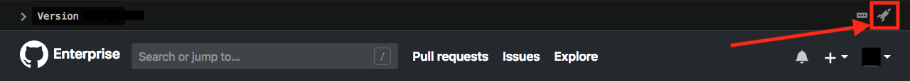
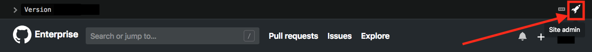
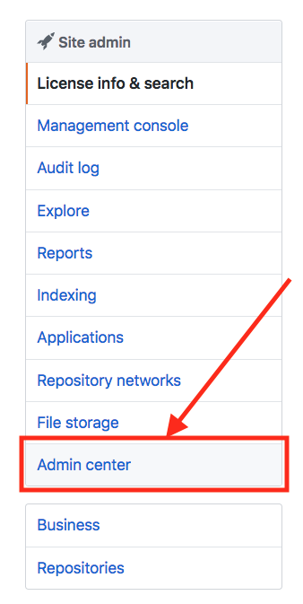
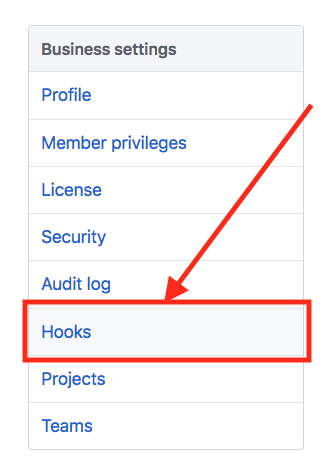
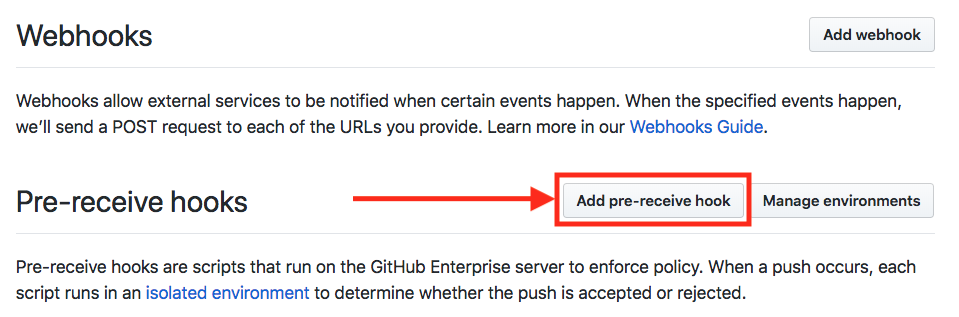
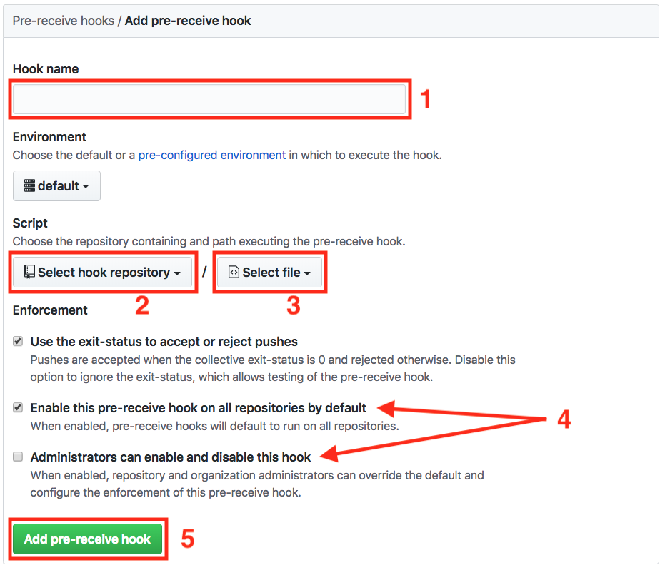
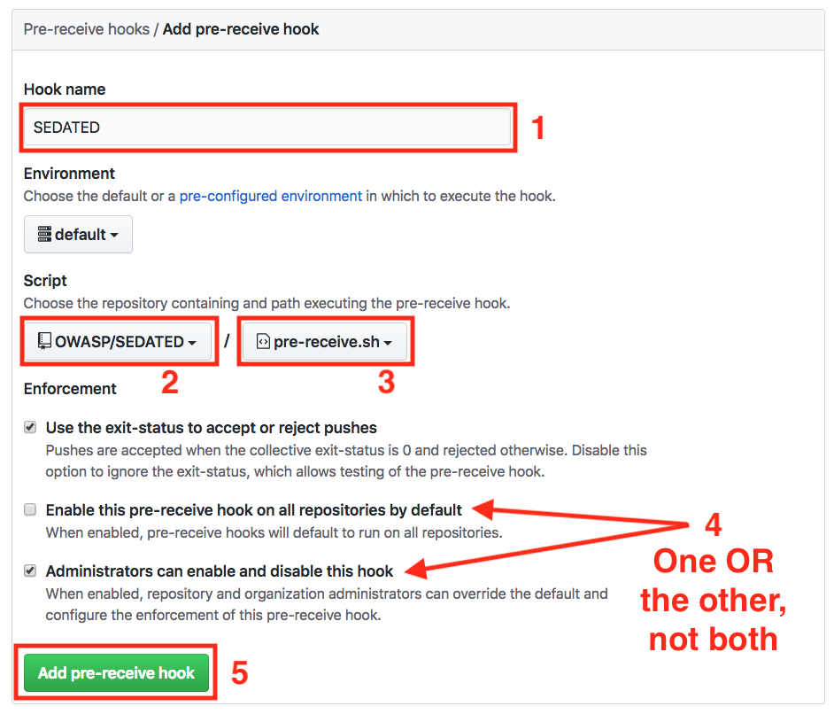
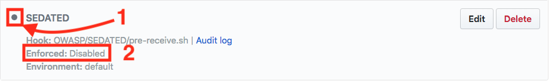

# **SEDATED&#8480;** GitHub Enterprise Setup
Walkthrough to setup **SEDATED&#8480;** on a GitHub Enterprise instance (*Take these steps only after completing steps 1 - 4 of the setup instructions in the [README](../README.md#setup)*)

## Step 1
Click the rocket ship

## Step 2
Click the rocket ship again

## Step 3
Click "Admin Center" from the menu on the left of the screen

## Step 4
Click "Hooks" from the menu on the left of the screen

## Step 5
Click "Add pre-receive hook"

## <a id="step6">Step 6</a>

1. Under "Hook name" type "SEDATED"
2. Click "Select hook repository" from the dropdown
    - Enter the organization/repository your **SEDATED&#8480;** repository resides
3. Click "Select file" from the dropdown
    - Select `pre-receive.sh`
4. Check the appropriate box for the desired enforcement level
    - "Use the exit-status to accept or reject pushes" - This option MUST BE checked for **SEDATED&#8480;** to function as designed.
    - "Enable this pre-receive hook on all repositories by default" - Force enables **SEDATED&#8480;** on every repository in your enterprise. If you select this option you may want to consider setting the [use_enforced_repo_check_custom](../README.md#customVars) option to "True" in **SEDATED&#8480;**. This will allow you to control which repositories have **SEDATED&#8480;** enforced (scanning new/modified code that is pushed) and which repositories will merely see a message from **SEDATED&#8480;** (no code scanning will be done). A phased rollout of **SEDATED&#8480;** can be accomplished this way, by gradually enforcing more and more repositories.
    - "Administrators can enable and disable this hook" - Allows administrators, organization owners, and repository owners to enable and disable **SEDATED&#8480;** as they desire. This would potentially be a good option for the proof of concept phase of **SEDATED&#8480;** and trying to get development teams to early adopt. However, since teams can essentially turn **SEDATED&#8480;** on and off on a whim the effectiveness of **SEDATED&#8480;** will be limited.
5. Click "Add pre-receive hook"

## Step 7
Verify under pre-receive hooks that "SEDATED" is now listed with the desired configurations
1. If the box for "Administrators can enable and disable this hook" was checked then this dot will be grayed out (as shown below). If the box for "Enable this pre-receive hook on all repositories by default" was checked then this dot will be green.
2. If the box for "Administrators can enable and disable this hook" was checked then "Enforced: " will show "Disabled" (as shown below). If the box for "Enable this pre-receive hook on all repositories by default" was checked then "Enforced: " will show "Enabled".

## **SEDATED&#8480;** is now setup and ready to use in GitHub Enterprise!

To verify that **SEDATED&#8480;** is now enabled simply create a commit and push to GitHub, you will now see a **SEDATED&#8480;** message returned in the server response. If you chose to check the "Administrators can enable and disable this hook" upon creation of the **SEDATED&#8480;** pre-receive hook ([Step 6](#step6) above) then the **SEDATED&#8480;** pre-receive hook will need to be [manually enabled](GitHub_Repo_Setup.md) on a repository to test. 
