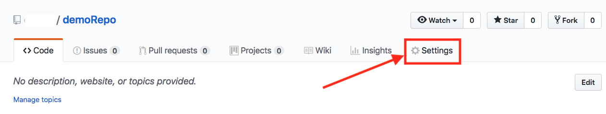
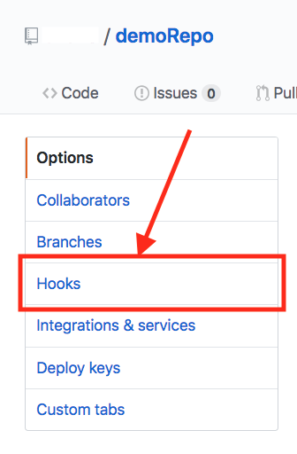
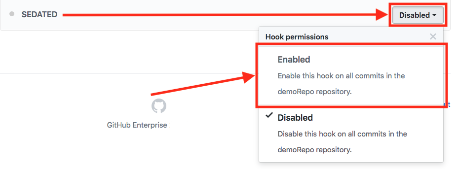

# **SEDATED&#8480;** GitHub Repo Setup
This setup page is intended to show how to enforce **SEDATED&#8480;** on a single repository from a GitHub Enterprise instance (these same steps can also be taken at the organization level if you have organization owner level permissions). 

*NOTE 1: If your implementation of **SEDATED&#8480;** is Enterprise-wide (i.e. you checked the box "Enable this pre-receive hook on all repositories by default" upon [initial pre-receive hook setup](GitHub_Enterprise_Setup.md)) then you do not need to perform these steps as **SEDATED&#8480;** has already been force enabled across your enterprise.*

*NOTE 2: If the **SEDATED&#8480;** pre-receive hook has not yet been setup in GitHub Enterprise please follow the steps to do that in [GitHub_Enterprise_Setup.md](GitHub_Enterprise_Setup.md)*

## Step 1
From a repository you own click "Settings"

*NOTE: If you do not see the "Settings" option you do not have the required permissions to enable **SEDATED&#8480;** on this ropository. Go to a repository you have the required permissions to and repeat Step 1.*

## Step 2
Click "Hooks" from the menu on the left

## Step 3
Under Pre-receive hooks find "SEDATED" and click the "Disabled" dropdown and select "Enabled"

## That's it!
Now all pushes to this repository will be filtered through **SEDATED&#8480;**!
